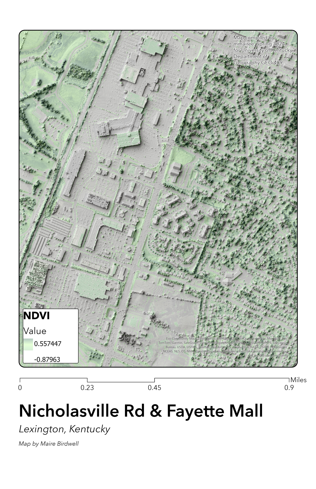

# Nicholasville Road & Fayette Mall Area
## Lexington, Kentucky

This map showcases the shaded relief of Fayette Mall and other locations located on Nicholasville Road. This area is in south Lexington, where the busiest road, Nicholasville Rd is located. Many businesses are located on this road, including the Fayette Mall, The Summit, Churches, a Movie Theater, and many restaurants. 

     
*Caption of Map*

[Link to high-resolution version (Portrait)](SummitLayout_Portrait.pdf)    

[Link to high-resolution version (Landscape)](SummitLayout_Portrait.pdf)   

This map was created by Maire Birdwell, an undergraduate geography student at the University of Kentucky. 

Map compiled in Spring 2024
for University of Kentucky,
Department of
Geography GEO 409.

Mapping Data comes from KyFromAbove.ky.gov